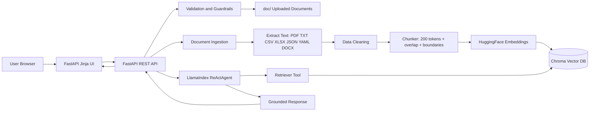
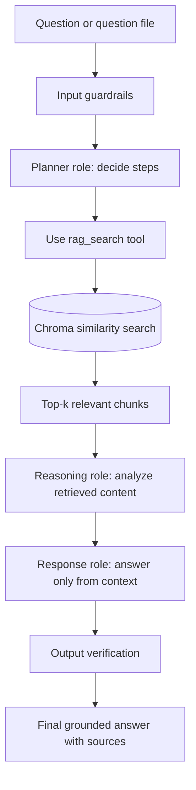

# Capstone Design Document: RAG Agent over Uploaded Documents

## 1. Goal

Build a production-style Retrieval-Augmented Generation application that lets a user upload documents, index them into a Chroma vector database, ask natural-language questions, and receive grounded answers from a single LlamaIndex ReAct agent.

## 2. System architecture diagram

## 3. Runtime architecture

The runtime is split into six layers:

1. User interaction layer: FastAPI web pages and OpenAPI endpoints.
2. Validation and security layer: file type checks, file size checks, path-safe filenames, prompt-injection pattern checks, and output fallback.
3. Ingestion layer: extracts raw data from PDF, TXT, Markdown, CSV, Excel, JSON, YAML, and DOCX.
4. Semantic preparation layer: cleans text and splits it into manageable chunks using a 200-token target with overlap.
5. Knowledge store layer: creates embeddings and persists vectors plus metadata in Chroma.
6. Agent/RAG layer: a single ReAct agent plans, retrieves, reasons, and responds using available tools.

## 4. Agent workflow

The implementation uses one `RAGReActAgent` class. Internally it maps the required roles as follows:

| Required role | Implemented by |
| --- | --- |
| Planner Agent | ReAct planning prompt and tool selection |
| Retriever Agent | `rag_search` FunctionTool calling Chroma retrieval |
| Reasoning Agent | Agent prompt with grounding rules |
| Response Agent | Final answer and fallback verification |

If `OPENAI_API_KEY` is not configured, the app still works by returning extractive answers from retrieved chunks. This keeps demos reliable even when an LLM key is unavailable.

## 5. RAG pipeline

1. User uploads documents to `doc/` through the UI or `/api/v1/upload`.
2. API validates extension and file size.
3. Loader extracts raw text using the correct parser.
4. Cleaning removes nulls, excessive whitespace, and empty content.
5. Chunker splits text around 200 tokens with overlap and sentence/paragraph boundaries.
6. Embedding model converts chunks to vectors.
7. Chroma stores vector, text, and metadata such as source filename and page.
8. Question is embedded and retrieved using top-k similarity search.
9. LLM or fallback answer generation produces a grounded answer.
10. Output verification ensures no answer is returned when no sources exist.

## 6. API and UI usage

### UI screens

- `/`: Screen 1 for prompt file, question textbox, multiple-question file, and optional documents.
- `/health-ui`: Screen 2 for API, RAG, Chroma, and upload health.
- `/upload-ui`: Screen 3 for document upload to RAG and Chroma.
- `/docs`: OpenAPI Swagger documentation automatically generated by FastAPI.

### REST endpoints

| Method | Endpoint | Purpose |
| --- | --- | --- |
| GET | `/api/v1/health` | API, Chroma, vector count, doc count, agent status |
| POST | `/api/v1/upload` | Save uploaded files under `doc/` and optionally ingest |
| POST | `/api/v1/ingest-local` | Ingest all supported files already under `doc/` |
| POST | `/api/v1/query` | Multipart question/prompt/questions/documents request |
| POST | `/api/v1/query-json` | JSON question request |
| GET | `/api/v1/search` | Return retrieved chunks without generation |
| GET | `/api/v1/documents` | List files under `doc/` |

## 7. Implementation steps

1. Create a Python 3.11 virtual environment.
2. Install packages with `pip install -r requirements.txt`.
3. Copy `.env.example` to `.env`.
4. Set `OPENAI_API_KEY` if LLM generation and ReActAgent are required.
5. Place source documents in `doc/` or upload through the UI.
6. Run `python scripts/ingest_folder.py --folder doc` or upload with ingest enabled.
7. Start app with `uvicorn app.main:app --reload --host 0.0.0.0 --port 8000`.
8. Ask questions from the UI or `/api/v1/query-json`.
9. Use `/health-ui` or `/api/v1/health` to confirm vector count and agent state.

## 8. Assumptions

- Uploaded files are non-malicious business/classroom documents within configured file size limits.
- The default embedding model can be downloaded by the runtime environment during first startup.
- Chroma local persistence is acceptable for capstone and small-team use.
- Render filesystem persistence may be ephemeral unless persistent disk or external vector store is configured.
- The LLM provider is OpenAI through LlamaIndex when `OPENAI_API_KEY` is set.

## 9. Limitations

- Scanned PDFs require OCR, which is intentionally not included to keep the capstone lightweight.
- Local Chroma is not recommended as the only persistence layer for high-scale production.
- Prompt-injection filtering is pattern-based and should be enhanced for regulated production systems.
- The fallback mode is extractive and does not synthesize like a full LLM.
- Very large Excel or CSV files should be pre-cleaned or chunked offline.
- The app does not implement authentication by default; add auth before public deployment.

## 10. Security considerations

- File extension allowlist prevents unsupported file parsing.
- File size limit reduces denial-of-service risk.
- Sanitized filenames prevent path traversal into sensitive directories.
- Prompt files are treated as untrusted user content and lower priority than system guardrails.
- Agent is instructed to answer only from retrieved context.
- Output verification prevents free-form answers when retrieval returns no source chunks.
- Secrets are provided through environment variables and are not stored in `render.yaml`.
- Production deployment should add authentication, authorization, HTTPS, rate limiting, malware scanning, and persistent storage.
